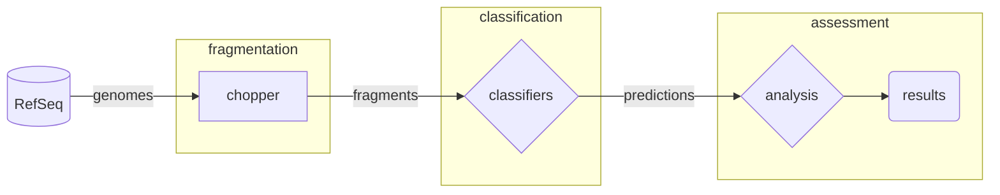
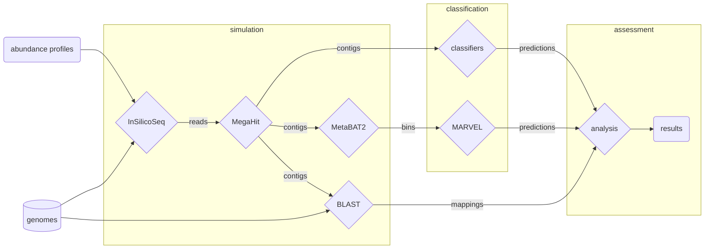

# challenging-phage-finders
A benchmarking study comparing various phage finding tools through carefully crafted mock communities.

Restoring R environment:

```
Rscript -e "install.packages('renv')"
Rscript -e "renv::restore()"
```

## Overview of Experiments

### Fragmented Genomes

Complete genomes from RefSeq are fragmented into lengths of 500, 1000, 3000, and 5000 nt. These fragments are passed to the contig classifiers, and their performance is assessed.




### Simulated Metagenomes

Abundance profiles created by Bracken from various samples are used to create simulated metagenomes with InSilicoSeq. These are assembled with MegaHit, and binned using MetaBAT2. The contigs from MegaHit are given to the contig classifiers and the bins from MetaBAT2 are passed to MARVEL for predictions. For assessment, the contigs are mapped to the input genomes using BLAST.

