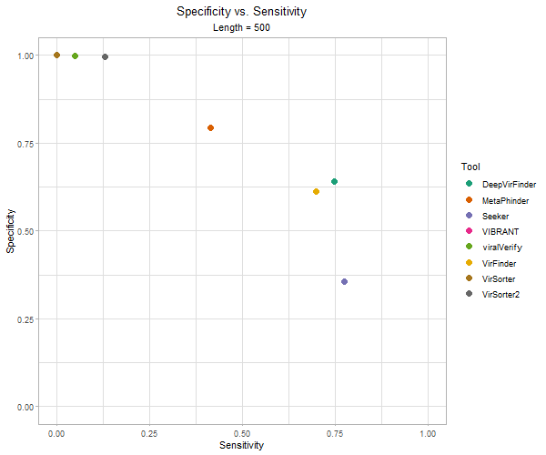

# {.tabset}

## Overview

### Experiment Description

---

#### Genome Chopping

---

Complete genomes were downloaded from RefSeq from the four "kingdoms": archaea, bacteria, fungi, and virus.

These genomes were "chopped" into non-overlapping fragments of the following lengths: 500, 1000, 3000, and 5000 nt.

The program `src/genome_chopper/chopper.py` was used to chop the genomes. Chopped genomes were written to `data/chopped` with 1 file per genome containing all the fragments of a given size for that genome.

The total number of complete genomes that were chopped from each category are as follows:

Kingdom  | No. Chopped Genomes
:-:      | :-:
archaea  | 758
bacteria | 43,576
fungi    | 36
virus    | 22,312

<hr style="border:1px solid gray"> </hr>

#### Fragment selection

---

The following quantity of genome fragments were selected:

Kingdom  | 500 nt | 1000 nt | 3000 nt | 5000 nt
:-:      | :-:    | :-:     | :-:     | :-:
archaea  | 10k    | 10k     | 10k     | 10k
bacteria | 10k    | 10k     | 10k     | 10k
fungi    | 10k    | 10k     | 10k     | 10k
virus    | 10k    | 10k     | 10k     | 10k

Fragment selection was done using the Snakemake pipeline in `src/data_selection/`. Currently, it was performed with replacement. The selected fragments were written to `data/selected_frags/`. Other folders may be added, such as `data/selected_frags_1/`, `data/selected_frags_2/`, *etc.* for replicates.

<hr style="border:1px solid gray"> </hr>

#### Classification

---

The selected genome fragments were classified with the following tools:

* DeepVirFinder
* MetaPhinder
* Seeker
* Unlimited Breadsticks
* VIBRANT
* ViralVerify
* VirFinder
* VirSorter
* VirSorter2

Classification was run using the Snakemake pipeline in `src/classify_chopped/`.

Results were written to `data/classified_chopped/`.

All classifications are combined into the file `data/classified_chopped/combined_out/combined.csv`

Additionally, the RefSeq ID and description of each selected fragment is extracted and written to `data/classified_chopped/combined_out/organisms.csv`.

<hr style="border:1px solid gray"> </hr>

#### Resource Usage

---

Snakemake benchmark command was used to record resource usage. Individual files are written to `src/classify_chopped/benchmarks/`. I may want to change that and have them written to the `data/classified_chopped_n/` folder(s).

All benchmark files are combined and written to `data/classified_chopped/combined_out/combined_benchmarks.csv`.

<hr style="border:1px solid gray"> </hr>

### This Analysis

---

All analysis included here is conducted on the combined files:

* `data/classified_chopped/combined_out/combined.csv`
* `data/classified_chopped/combined_out/combined_benchmarks.csv`
* `data/classified_chopped/combined_out/organisms.csv`

## Data Cleaning

```{r setup, include=FALSE}
library(caret)
library(dplyr)
library(gganimate)
library(ggplot2)
library(ggrepel)     # Line plot text labels
library(gifski)      # Render animations
library(hurwitzLab)  # Colors and palettes
library(stringr)     # str_glue()
library(tidyr)

# Set ggplot2 theme for whole R session
theme_set(theme_light() +
            theme(plot.title = element_text(hjust = 0.5),
                  plot.subtitle = element_text(hjust = 0.5)))

# Read in all classifications
raw_class_df <-
  read.csv('../../data/classified_chopped_small/combined_out/combined.csv')

# Read in Snakemake benchmarks
raw_bench_df <-
  read.csv('../../data/classified_chopped_small/combined_out/combined_benchmarks.csv')

# Read in list of organisms
raw_organisms_df <-
  read.csv('../../data/classified_chopped_small/combined_out/organisms.csv')
```

### Clean Classification Results

---

#### Clean VirSorter Record Names

---

It seems that I have an error in my post-processing script for VirSorter, where the record is not just the record ID, but the entire description as well.

```{r show_virsorter, echo=FALSE}
raw_class_df %>%
  filter(tool == 'virsorter') %>%
  select(record)
```

I will fix that script later, but for now, I will just clean that up. Here they are after cleaning in R.

```{r fix_virsorter, echo=FALSE}
class_df <- raw_class_df

class_df$record <- class_df$record %>%
  str_remove("_Fragment.*") %>% # Remove from "_Fragment." to the end
  str_replace("(_)([:digit:]+)$", ".\\2") # Replace final underscore with dot

class_df %>%
  filter(tool == 'virsorter')
```

<hr style="border:1px solid gray"> </hr>

#### Fill in Missing Classifications

---

Some tools provide a classification for all sequences while others only include those classified as viral in their output. Therefore, the number of fragments in the final output is different for the various tools.

```{r num_by_tool, echo=FALSE}
class_df %>%
  group_by(tool) %>%
  count()
```

I want to fill in the negative classifications for those tools that only include positive classifications.

```{r fill_negs, echo=FALSE}
class_df <- class_df %>%
  mutate(rec_len_act = str_c(record, "--", length, "--", actual)) %>%
  select(-record,-length,-actual) %>%
  complete(rec_len_act, tool,  fill = list(prediction = "non-viral")) %>%
  separate(rec_len_act,
           into = c("record", "length", "actual"),
           sep = "--")

class_df %>%
  group_by(tool) %>%
  count() 
    
```

*Note*: some tools would not process contigs shorter than a certain length. So these were not necessarily negative classifications. However, if these tools were being used to flag viral contigs, those skipped contigs would not have been flagged, which is why I am considering them negative.

<hr style="border:1px solid gray"> </hr>

#### Consistent Classification Naming

---

The various tools have their own conventions for classification types. Here are all the classification labels seen.

```{r show_classses, echo=FALSE}
class_df$prediction %>%
  as.factor() %>%
  levels()
```

I will create a column that is binary - `viral` or `non-viral`. This will need to be updated if more tools are added.

```{r binarize}
viral_classes = c("dsDNAphage", "phage", "viral", "Virus")
nonviral_classes = c(
  "bacteria",
  "Chromosome",
  "non-viral",
  "Plasmid",
  "ssDNA",
  "Uncertain - plasmid or chromosomal",
  "Uncertain - too short",
  "Uncertain - viral or bacterial"
)

class_df <- class_df %>%
  mutate(
    class = case_when(
      prediction %in% viral_classes ~ "viral",
      prediction %in% nonviral_classes ~ "non-viral"
    ),
    actual_class = case_when(actual == "viral" ~ "viral",
                             actual != "viral" ~ "non-viral")
  ) %>%
  mutate(
    class = as.factor(class),
    actual_class = as.factor(actual_class),
    length = factor(length, levels = c("500", "1000", "3000", "5000"))
  )

class_df$class %>%
  levels()
```

<hr style="border:1px solid gray"> </hr>

#### Reformat Tool Names

---

Update the names of the tools to be properly stylized.

```{r rename_tools, echo = FALSE}
class_df <- class_df %>%
  mutate(
    tool = case_when(
      tool == "dvf" ~ "DeepVirFinder",
      tool == "metaphinder" ~ "MetaPhinder",
      tool == "seeker" ~ "Seeker",
      tool == "vibrant" ~ "VIBRANT",
      tool == "viralverify" ~ "viralVerify",
      tool == "virfinder" ~ "VirFinder",
      tool == "virsorter" ~ "VirSorter",
      tool == "virsorter2" ~ "VirSorter2"
    )
  ) %>%
  mutate(tool = as.factor(tool))

class_df$tool %>% levels()
```


<hr style="border:1px solid gray"> </hr>

#### Add Organism Information

---

The RefSeq ID's were extracted from the files containing the selected fragments. The description was also extracted. However, this is not the GenBank ID, and I may need some kind of mapping to get that if that is what we need.

```{r add organisms, echo = FALSE}
organisms_df <- raw_organisms_df %>%
  unique()

class_df <- class_df %>%
  mutate(refseqID =
           str_match(record,
                     "^frag_[:digit:]*_(.*)$")[, 2])

class_df <- left_join(class_df, organisms_df, by = "refseqID")

class_df %>%
  select(record, refseqID, length, actual, description) %>%
  unique()
```

```{r fix_bench_names, echo = FALSE}
bench_df <- raw_bench_df %>%
  rename(runtime = s) %>%
  mutate(length = factor(length, levels = c("500", "1000", "3000", "5000")))

bench_df %>% colnames()

bench_df <- bench_df %>%
  mutate(
    tool = case_when(
      tool == "breadsticks" ~ "Unlimited Breadsticks",
      tool == "dvf" ~ "DeepVirFinder",
      tool == "metaphinder" ~ "MetaPhinder",
      tool == "seeker" ~ "Seeker",
      tool == "vibrant" ~ "VIBRANT",
      tool == "viralverify" ~ "viralVerify",
      tool == "virfinder" ~ "VirFinder",
      tool == "virsorter" ~ "VirSorter",
      tool == "virsorter2" ~ "VirSorter2",
    )
  )
```


## Resource Usage

### Recorded Parameters

---

Snakemake benchmark files have the following columns:

Column Name | Unit | Description
:-:         | :-:  | :--
s           | sec  | Running time in seconds
h:m:s       |      | Running time in hour:minute:sec
max_rss     | MB   | Maximum "Resident Set Size”; non-swapped physical memory used
max_vsm     | MB   | Maximum “Virtual Memory Size”; total amount of virtual memory used
max:uss     | MB   | “Unique Set Size”; memory which is unique to a process and which would be freed if the process was terminated right now
max_pss     | MB   | “Proportional Set Size”; amount of memory shared with other processes, accounted in a way that the amount is divided evenly between the processes that share it (Linux only)
io_in       | MB   | the number of MB read (cumulative)
io_out      | MB   | the number of MB written (cumulative)
mean_load   |      | CPU usage over time, divided by the total running time (first row)
cpu_time    | sec  | CPU time summed for user and system

<hr style="border:1px solid gray"> </hr>

### Run Times

---

```{r time_tool_length, echo=FALSE}
bench_df %>%
  ggplot(aes(x = runtime / 60, y = tool, color = length)) +
  geom_jitter(alpha = 0.5, height = 0.3) +
  scale_color_hurwitz("distinguish") +
  scale_y_discrete(limits = rev) +
  labs(
    y = "",
    x = "Run time (min)",
    title = "Run times for classifying 500 fragments",
    color = "Length"
  )
```
```{r meantime_tool_length, echo=FALSE, message=FALSE}
bench_df %>%
  group_by(tool, length) %>%
  summarize(mean_runtime = mean(runtime)) %>%
  ggplot(aes(x = mean_runtime / 60, y = tool, fill = length)) +
  geom_col(position = "dodge",
           alpha = 0.75,
           width = 0.75) +
  scale_fill_hurwitz("distinguish") +
  scale_y_discrete(limits = rev) +
  labs(y = "",
       x = "Run time (min)",
       title = "Average run time for classifying 500 fragments",
       fill = "Length")
```

<hr style="border:1px solid gray"> </hr>

### Read and Write Operations

---

#### Read Operations

---

```{r read, echo=FALSE}
bench_df %>%
  ggplot(aes(x = io_in, y = tool, color = length)) +
  geom_jitter(alpha = 0.5, height = 0.3) +
  scale_color_hurwitz("distinguish") +
  scale_y_discrete(limits = rev) +
  labs(
    y = "",
    x = "Read Operations (MB)",
    title = "Read operations for classifying 500 fragments",
    color = "Length"
  )
```

```{r mean_read, echo=FALSE, message=FALSE}
bench_df %>%
  group_by(tool, length) %>%
  summarize(mean_read = mean(io_in)) %>%
  ggplot(aes(x = mean_read, y = tool, fill = length)) +
  geom_col(position = "dodge",
           alpha = 0.75,
           width = 0.75) +
  scale_fill_hurwitz("distinguish") +
  scale_y_discrete(limits = rev) +
  labs(y = "",
       x = "Mean Read Operations (MB)",
       title = "Average read operations for classifying 500 fragments",
       fill = "Length")
```

#### Write Operations

---

```{r write, echo=FALSE}
bench_df %>%
  ggplot(aes(x = io_out, y = tool, color = length)) +
  geom_jitter(alpha = 0.5, height = 0.3) +
  scale_color_hurwitz("distinguish") +
  scale_y_discrete(limits = rev) +
  labs(
    y = "",
    x = "Write Operations (MB)",
    title = "Write operations for classifying 500 fragments",
    color = "Length"
  )
```

```{r mean_write, echo=FALSE, message=FALSE}
bench_df %>%
  group_by(tool, length) %>%
  summarize(mean_write = mean(io_out)) %>%
  ggplot(aes(x = mean_write, y = tool, fill = length)) +
  geom_col(position = "dodge",
           alpha = 0.75,
           width = 0.75) +
  scale_fill_hurwitz("distinguish") +
  scale_y_discrete(limits = rev) +
  labs(y = "",
       x = "Mean Write Operations (MB)",
       title = "Average write operations for classifying 500 fragments",
       fill = "Length")
```

## General Classification Perfomance

Here we will look at the general classification performance of the classifiers. This general analysis only looks at "viral" vs. "non-viral" classes. Refined analysis will be shown later.

At this point, we can note that *Unlimited Breadsticks* did not identify any contigs as "viral". However, the tool seems to be running. This can be seen from the fact that in the resource usage analysis, Unlimited Breadsticks had longer compute time for longer contigs.

```{r, echo = FALSE}
metrics <- tibble(
  tool = factor(),
  length = factor(),
  tp = numeric(),
  fp = numeric(),
  tn = numeric(),
  fn = numeric(),
  F1 = numeric(),
  sensitivity = numeric(),
  specificity = numeric(),
  precision = numeric(),
  recall = numeric()
)

for (tool_i in levels(class_df$tool)) {
  for (length_i in levels(class_df$length)) {
    tool_df <- class_df %>%
      filter(tool == tool_i) %>%
      filter(length == length_i)
    
    cm <- confusionMatrix(tool_df$class,
                          tool_df$actual_class,
                          positive = "viral")
    
    num_neg <- cm$table[1] + cm$table[2]
    num_pos <- cm$table[3] + cm$table[4]
    
    cm$table[1] <- cm$table[1] / num_neg
    cm$table[2] <- cm$table[2] / num_neg
    cm$table[3] <- cm$table[3] / num_pos
    cm$table[4] <- cm$table[4] / num_pos
    
    metrics <- metrics %>%
      add_row(
        tool = tool_i,
        length = length_i,
        tp = cm$table[4],
        fp = cm$table[2],
        tn = cm$table[1],
        fn = cm$table[3],
        F1 = cm$byClass["F1"],
        specificity = cm$byClass["Specificity"],
        sensitivity = cm$byClass["Sensitivity"],
        precision = cm$byClass["Precision"],
        recall = cm$byClass["Recall"]
      )
  }
}

metrics <- metrics %>%
  mutate(length = factor(length, levels = c("500", "1000", "3000", "5000")))

metrics
```

<hr style="border:1px solid gray"> </hr>

### *F1* Score by Tool

---

Definition:

* $F1=\frac{2*precision*recall}{precision+recall}$

*F1*-score is the harmonic mean of precision and recall.

```{r, echo=FALSE}
metrics %>%
  ggplot(aes(x = F1, y = tool, fill = length)) +
  geom_col(position = "dodge",
           alpha = 0.75,
           width = 0.75) +
  scale_fill_hurwitz("distinguish") +
  scale_y_discrete(limits = rev) +
  labs(x = "F1 Score",
       y = "",
       fill = "Length")
```

Next, lets see how dependent *F1*-score is on length more explicitly.


```{r f_length, echo=FALSE}
metrics %>%
  mutate(length = as.numeric(as.character(length))) %>%
  ggplot(aes(x = length, y = F1, color = tool)) +
  geom_line(alpha = 0.5) +
  geom_point(size = 2) +
  geom_label_repel(
    data = metrics %>%
      mutate(length = as.numeric(as.character(length))) %>%
      filter(length == max(length)),
    aes(label = tool),
    xlim = 5500,
    label.size = NA,
    label.padding = 0
  ) +
  scale_color_hurwitz("distinguish") +
  theme(legend.position = "none") +
  xlim(c(NA, 6500)) +
  labs(x = "Fragment length (nt)",
       y = "F1-score",
       color = "Tool")
```

<hr style="border:1px solid gray"> </hr>

### Precision vs. Recall

---

Definitions:

* $precision = \frac{TP}{TP + FP}$
* $recall = sensitivity = \frac{TP}{TP + FN}$

These are the components that determine *F1*-score. Those with high *F1*-score will have points in the top right of their precision-recall plot.

```{r, echo = FALSE}
metrics %>%
  ggplot(aes(y = precision, x = recall, color = length)) +
  facet_wrap( ~ tool) +
  geom_point(size = 2) +
  scale_color_hurwitz("distinguish") +
  lims(x = c(0, 1), y = c(0, 1)) +
  labs(y = "Precision",
       x = "Recall (Sensitivity)",
       color = "Length")
```

The animation below shows how the precision and recall of each tool shifts based on length.

```{r, echo = FALSE, results = FALSE}
anim <- metrics %>%
  ggplot(aes(y = precision, x = recall, color = tool)) +
  geom_point(size = 3) +
  scale_color_brewer(palette = "Dark2") +
  lims(x = c(0, 1), y = c(0, 1)) +
  labs(y = "Precision",
       x = "Recall (Sensitivity)",
       color = "Tool") +
  transition_states(length) +
  ggtitle("Precision vs. Recall",
          subtitle = "Length = {closest_state}")

anim_save(
  "figures/animated_precision_recall.gif",
  anim,
  width = 600,
  height = 500
)
```


<hr style="border:1px solid gray"> </hr>

### Sensitivity vs. Specificity

---

Definitions:

* $sensitivity = \frac{TP}{TP + FN}$
* $specificity = \frac{TN}{TN + FP}$

Often the tradeoff is sensitivity vs. specificity. For instance, a reference-based method may be expected to detect fewer viral contigs (low sensitivity), but also have few false positives (high specificity). The highest performing tools would have both high sensitivity and specificity, and would have point toward the top right of their sensitivity vs specificity plot.

**Some notable trends**:

Several tools have very high specificity:

* VIBRANT
* viralVerify
* VirSorter
* VirSorter2

VirSorter, however has very poor sensitivity.

Some tools have high sensitivity:

* DeepVirFinder
* MetaPhinder
* VirFinder
* Seeker

Seeker has the lowest specificity of all.

Those tools with high specificity (VIBRANT, viralVerify, VirSorter2) have sensitivity that is more dependent on contig length than those with generally higher sensitivity (DeepVirFinder, MetaPhinder, Seeker, VirFinder)

```{r, echo=FALSE}
metrics %>%
  ggplot(aes(x = sensitivity, y = specificity, color = length)) +
  facet_wrap( ~ tool) +
  geom_point(size = 2) +
  scale_color_hurwitz("distinguish") +
  lims(x = c(0, 1), y = c(0, 1)) +
  labs(x = "Sensitivity",
       y = "Specificity",
       color = "Length")
```

Here is a similar plot, but animated along length.

```{r, echo = FALSE, results = FALSE}
anim <- metrics %>%
  ggplot(aes(x = sensitivity, y = specificity, color = tool)) +
  geom_point(size = 3) +
  scale_color_brewer(palette = "Dark2") +
  lims(x = c(0, 1), y = c(0, 1)) +
  labs(y = "Specificity",
       x = "Sensitivity",
       color = "Tool") +
  transition_states(length) +
  ggtitle("Specificity vs. Sensitivity",
          subtitle = "Length = {closest_state}")

anim_save(
  "figures/animated_specificity_sensitivity.gif",
  anim,
  width = 600,
  height = 500
)
```



<hr style="border:1px solid gray"> </hr>

### ROC Snapshot

---

This is not a true Receiver Operating Characteristic curve since I am only plotting  discrete points. I may try to plot real ROC, but that will only be possible for probabilistic classifiers that output their probabilities.

The axes shown here are the components that constitute precision. Tools with high precision will have points in the top left corner of the TP vs FP plot.

```{r, echo=FALSe}
metrics %>%
  ggplot(aes(x = fp, y = tp, color = length)) +
  facet_wrap( ~ tool) +
  geom_point(size = 2) +
  scale_color_hurwitz("distinguish") +
  lims(x = c(0, 1), y = c(0, 1)) +
  labs(x = "False Positive Rate",
       y = "True Positive Rate",
       color = "Length")
```

```{r, echo = FALSE, results = FALSE}
anim <- metrics %>%
  ggplot(aes(x = fp, y = tp, color = tool)) +
  geom_point(size = 3) +
  scale_color_brewer(palette = "Dark2") +
  lims(x = c(0, 1), y = c(0, 1)) +
  labs(x = "False Positive Rate",
       y = "True Positive Rate",
       color = "Tool") +
  transition_states(length) +
  ggtitle("TPR vs. FPR",
          subtitle = "Length = {closest_state}")

anim_save("figures/animated_tpr_fpr.gif",
          anim,
          width = 600,
          height = 500)
```


## Organism breakdown

### Top organisms

---

Top genuses (geni?) for non-viral organisms.

```{r prokarya, echo=FALSE}
nonviral <- class_df %>%
  filter(actual != "viral") %>%
  mutate(
    genus = str_match(description,
                      "^([:alpha:]*).*$")[, 2],
    species = str_match(description,
                        "^[:alpha:]*\\s([:alpha:]*[^'sp.']).*$")[, 2]
  )
```

<hr style="border:1px solid gray"> </hr>

#### Top archaea

---

```{r top_archaea, echo=FALSE}
nonviral %>%
  filter(actual == "archaea") %>%
  group_by(genus) %>%
  count() %>%
  mutate(num_frags = n / length(levels(nonviral$tool))) %>%
  select(-n) %>%
  arrange(desc(num_frags))
```

<hr style="border:1px solid gray"> </hr>

#### Top bacteria

---

```{r top_bacteria, echo=FALSE}
nonviral %>%
  filter(actual == "bacteria") %>%
  group_by(genus) %>%
  count() %>%
  mutate(num_frags = n / length(levels(nonviral$tool))) %>%
  select(-n) %>%
  arrange(desc(num_frags))
```

<hr style="border:1px solid gray"> </hr>

#### Top fungi

---

```{r top_fungi, echo=FALSE}
nonviral %>%
  filter(actual == "fungi") %>%
  group_by(genus) %>%
  count() %>%
  mutate(num_frags = n / length(levels(nonviral$tool))) %>%
  select(-n) %>%
  arrange(desc(num_frags))
```
