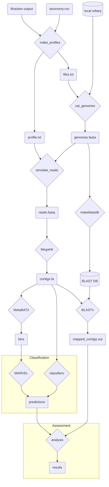

# Simulate Metagenomes using InSilicoSeq

This is a Snakemake pipeline for generating simulated metagenomes. Simulated reads are created by InSilicoSeq, with abundance profiles from various environments as determined by Bracken.

To run the full pipeline, execute:

```
$ sbatch run.slurm
```

To see a dry run of the pipeline, execute:

```
make dryrun
```

Additional profiles can be placed in the bracken output directory (see `config/config.yaml`), and no changes need to be made to any files; the pipeline will discover new profiles and run.

# Pipeline description

1. Generate a profile from Bracken output
2. Concatenate the genomes present in the profile to a multifasta file
3. Simulate reads using InSilicoSeq
4. Assemble contigs using MegaHit
5. Bin contigs using MetaBAT2
6. Map reads to input genomes with BLAST

The following diagram shows the main portions of the pipeline. *Note* the pipeline in this directory ends with 3 results:

* Contigs
* Bins
* Mappings

`Classification` and `Assessment` will be in pipelines in their own directories. I will create a master snakemake to run all 3 pipelines in the root of this repo.



## Genome Concatenation

InSiicoSeq treats each record in a multi-FASTA file as a genome, and requires a profile file giving the abundance of each genome. However, some genome files have multiple records (*e.g.* separated by chromosome).

The two files are created using scripts located here. First, `bracken_profiler.py` parses bracken output and creates two files: one with the profile, ready for input to InSilicoSeq, and a file with information on the genomes that need to be retrieved, such as file name globs and the accession numbers that were written in the profile.

Next, `cat_genomes.py` reads the information file, retrieves all the genomes in the profile, removes the record headers for each genome, adds the accession number as the header, and writes them all to one large file, which is the other input to InSilicoSeq.

## Read Simulation

Read simulation is done by InSilicoSeq. The inputs are the genomes file created by `cat_genomes.py` and the abundance profile created by `bracken_profiler.py`. Multiple error models can be automatically executed by inclusion in the config["model"] field, which currently includes all pre-built error models (novaseq, hiseq, and miseq).

## Assembly

Megahit is used for assembling the simulated reads into contigs.

## Binning

MetaBAT2 is used for binning the contigs. Default values are used currently, since MetaBAT2 has improved default values over MetaBAT.

## BLAST alignment

To determine the true origins of the contigs, BLAST is run. Each BLAST database is created from the same file of genomes that is passed to InSilicoSeq. Therefore, each profile will have its own BLAST database, containing only those organisms that constitute the profile. This prevents spurious hits to other organisms.

BLASTn is run, querying the contigs created by MegaHit against the genomes in that profile.

# Programs

## `bracken_profiler.py`

This script takes Bracken output and creates a profile for use in InSilicoSeq. Taxonomic IDs are used to join the Bracken output with my list of refseq genomes. Since not all genomes may be found, the abundances are rescaled so they still add to 1. The abundance profile is written to `*_profile.txt`.

Additionally, a file is created (`*_files.txt`) that contains acession numbers and file globs. The files that match these globs are the files that contain the sequences in the profile.

Example usage
```
$ ./bracken_profiler.py -h
usage: bracken_profiler.py [-h] [-t FILE] [-o DIR] FILE [FILE ...]

Create profile from Bracken output

positional arguments:
  FILE                  Bracken output file(s)

optional arguments:
  -h, --help            show this help message and exit
  -t FILE, --taxonomy FILE
                        Taxonomy mapping file (default: ../../data/refseq_info/taxonomy.csv)
  -o DIR, --outdir DIR  Output directory (default: out)

 $ ./bracken_profiler.py tests/inputs/bracken_profiler/input_1.txt
Making profile for file "tests/inputs/bracken_profiler/input_1.txt"...
Finished.
Done. Wrote 1 profile to out.

$ ls out/
input_1_files.txt  input_1_profile.txt

# File globs do not include the parent directory (refseq)
$ head -n 5 out/input_1_files.txt 
filename,accession
archaea/GCF_000006175.1*.fna,GCF_000006175.1
bacteria/GCF_001742205.1*.fna,GCF_001742205.1
viral/GCF_000891875.6*.fna,GCF_000891875.6
fungi/GCF_013402915.1*.fna,GCF_013402915.1

$ head -n 5 out/input_1_profile.txt
GCF_000006175.1 0.6525
GCF_001742205.1 0.21977
GCF_000891875.6 0.12644
GCF_013402915.1 0.0013
```
## `cat_genomes.py`

This script concatenates all the genomes that are required for InSilicoSeq based on the profile.

There are 3 inputs:

* File containing genome information (`*_files.txt` output from `bracken_profiler.py`)
* `-p|--parent`: the parent directory from which the file globs are defined.
* `-o|--outdir`: output directory to write concatenated genomes.

The file globs are not full relative paths, they are like *archaea/GCF_000006175.1\*.fna*, so the `--parent` directory is provided to complete the relative path. For instance, if `--parent` = *../../data/refseq*, the full file glob that will be used is *../../data/refseq/archaea/GCF_000006175.1\*.fna*

Example usage
```
$ ./cat_genomes.py -h
usage: cat_genomes.py [-h] [-p DIR] [-o DIR] FILE [FILE ...]

Concatenate genomes from profile into single multifasta

positional arguments:
  FILE                  File(s) containing genome information

optional arguments:
  -h, --help            show this help message and exit
  -p DIR, --parent DIR  Directory prepended to file globs (default: ../../data/refseq)
  -o DIR, --outdir DIR  Output directory (default: out)

$ ./cat_genomes.py -p tests/inputs/cat_genomes/refseq/ tests/inputs/cat_genomes/input_1_files.txt 
Concatenated 4 files to out/input_1_genomes.fasta
Done. Concatenated files for 1 profile.

$ head -n 5 out/input_1_genomes.fasta
>GCF_000006175.1
AATTTAAAGATTAAAATTAGTAGACTGTCGATTTACAATATCATATTTATGAGTAATGATAATAACATTATCAAAGTATT
ATCTAAATATTTAGATTTAATATGTTTCTCAATGGAATATGTTAAATTTTATATTTATACATTATTGTAAAATCATAAAA
ATTTTTTAGAAAAATGTCTTAATCTTGCTAATTTTTGATTTATTGCCAAAATACACATTACTCATCAAATGAAAATTAGT
TCAAATATTGTGTATAATGTCCTGTGTAATATTACAAATTACTGTATGTAATATACCGTATGCAATATACAATAGTAAAT

$ grep ">" out/input_1_genomes.fasta 
>GCF_000006175.1
>GCF_001742205.1
>GCF_000891875.6
>GCF_013402915.1
```

## Test Suite

A test suite is provided for the programs that were written. The full suite can be run with:

```
$ make test
python3 -m pytest -v --flake8 --pylint --mypy tests/ bracken_profiler.py cat_genomes.py
============================ test session starts ============================
platform linux -- Python 3.8.10, pytest-6.2.4, py-1.10.0, pluggy-0.13.1 -- /usr/bin/python3
cachedir: .pytest_cache
rootdir: /home/ken/work/research/challenging-phage-finders/src/simulate_metagenomes
plugins: flake8-1.0.7, mypy-0.8.1, pylint-0.18.0
collected 35 items                                                          

tests/bracken_profiler_test.py::PYLINT SKIPPED (file(s) previousl...) [  2%]
tests/bracken_profiler_test.py::mypy PASSED                           [  5%]
tests/bracken_profiler_test.py::mypy-status PASSED                    [  8%]
tests/bracken_profiler_test.py::FLAKE8 SKIPPED (file(s) previousl...) [ 11%]
tests/bracken_profiler_test.py::test_exists PASSED                    [ 14%]
tests/bracken_profiler_test.py::test_testing_environment PASSED       [ 17%]
tests/bracken_profiler_test.py::test_usage PASSED                     [ 20%]
tests/bracken_profiler_test.py::test_bad_file PASSED                  [ 22%]
tests/bracken_profiler_test.py::test_bad_taxonomy_file PASSED         [ 25%]
tests/bracken_profiler_test.py::test_runs_okay PASSED                 [ 28%]
tests/cat_genomes_test.py::PYLINT SKIPPED (file(s) previously pas...) [ 31%]
tests/cat_genomes_test.py::mypy PASSED                                [ 34%]
tests/cat_genomes_test.py::FLAKE8 SKIPPED (file(s) previously pas...) [ 37%]
tests/cat_genomes_test.py::test_exists PASSED                         [ 40%]
tests/cat_genomes_test.py::test_testing_environment PASSED            [ 42%]
tests/cat_genomes_test.py::test_usage PASSED                          [ 45%]
tests/cat_genomes_test.py::test_bad_file PASSED                       [ 48%]
tests/cat_genomes_test.py::test_missing_parent PASSED                 [ 51%]
tests/cat_genomes_test.py::test_empty_parent PASSED                   [ 54%]
tests/cat_genomes_test.py::test_wrong_parent PASSED                   [ 57%]
tests/cat_genomes_test.py::test_runs_okay PASSED                      [ 60%]
bracken_profiler.py::PYLINT SKIPPED (file(s) previously passed py...) [ 62%]
bracken_profiler.py::mypy PASSED                                      [ 65%]
bracken_profiler.py::FLAKE8 SKIPPED (file(s) previously passed FL...) [ 68%]
bracken_profiler.py::test_clean_bracken PASSED                        [ 71%]
bracken_profiler.py::test_clean_taxonomy PASSED                       [ 74%]
bracken_profiler.py::test_join_dfs PASSED                             [ 77%]
bracken_profiler.py::test_rescale_abundances PASSED                   [ 80%]
bracken_profiler.py::test_make_files_df PASSED                        [ 82%]
bracken_profiler.py::test_make_profile_df PASSED                      [ 85%]
bracken_profiler.py::test_make_filenames PASSED                       [ 88%]
cat_genomes.py::PYLINT SKIPPED (file(s) previously passed pylint ...) [ 91%]
cat_genomes.py::mypy PASSED                                           [ 94%]
cat_genomes.py::FLAKE8 SKIPPED (file(s) previously passed FLAKE8 ...) [ 97%]
cat_genomes.py::test_make_filename PASSED                             [100%]
=================================== mypy ====================================

Success: no issues found in 4 source files
======================= 27 passed, 8 skipped in 5.01s =======================
```
