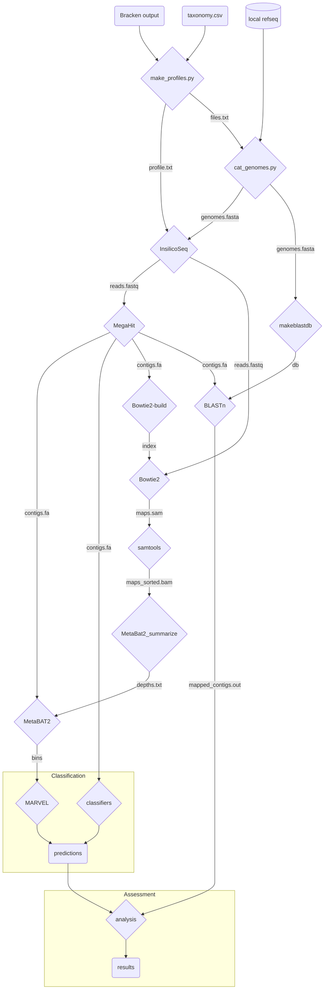
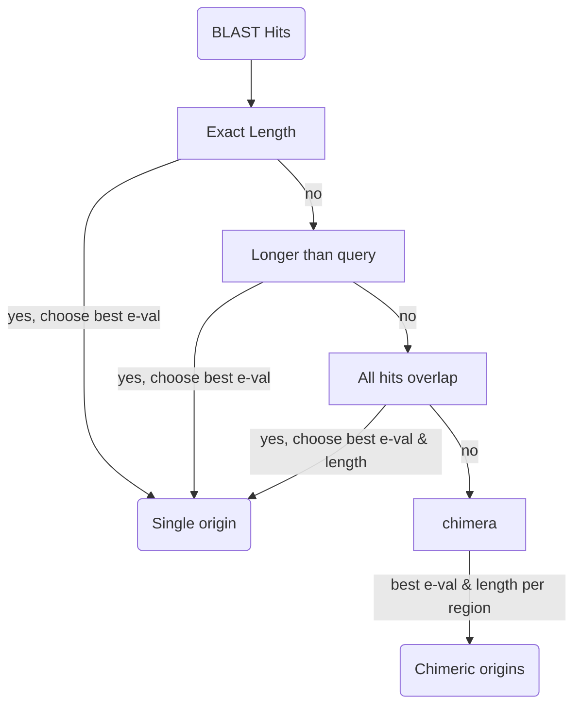

# Simulate Metagenomes using InSilicoSeq

This is a Snakemake pipeline for generating simulated metagenomes. Simulated reads are created by InSilicoSeq, with abundance profiles from various environments as determined by Bracken.

To run the full pipeline, execute:

```
$ sbatch run.slurm
```

To see a dry run of the pipeline, execute:

```
make dryrun
```

Additional profiles can be placed in the bracken output directory (see `config/config.yaml`), and no changes need to be made to any files; the pipeline will discover new profiles and run.

# Pipeline description

1. Generate a profile from Bracken output
2. Concatenate the genomes present in the profile to a multifasta file
3. Simulate reads using InSilicoSeq
4. Assemble contigs using MegaHit
5. Bin contigs using MetaBAT2
6. Map reads to input genomes with BLAST

The following diagram shows the main portions of the pipeline. Each node represents a rule. *Note* the pipeline in this directory ends with 3 results:

* Contigs
* Bins
* Mappings

`Classification` and `Assessment` will be in pipelines in their own directories. I will create a master snakemake to run all 3 pipelines in the root of this repo.



## Genome Concatenation

InSiicoSeq treats each record in a multi-FASTA file as a genome, and requires a profile file giving the abundance of each genome. However, some genome files have multiple records (*e.g.* separated by chromosome).

The two files are created using scripts located here. First, `bracken_profiler.py` parses bracken output and creates two files: one with the profile, ready for input to InSilicoSeq, and a file with information on the genomes that need to be retrieved, such as file name globs and the accession numbers that were written in the profile.

Next, `cat_genomes.py` reads the information file, retrieves all the genomes in the profile, removes the record headers for each genome, adds the accession number as the header, and writes them all to one large file, which is the other input to InSilicoSeq.

## Read Simulation

Read simulation is done by InSilicoSeq. The inputs are the genomes file created by `cat_genomes.py` and the abundance profile created by `bracken_profiler.py`. Multiple error models can be automatically executed by inclusion in the config["model"] field, which currently includes all pre-built error models (novaseq, hiseq, and miseq).

## Assembly

Megahit is used for assembling the simulated reads into contigs.

## Binning

MetaBAT2 is used for binning the contigs. Default values are used currently, since MetaBAT2 has improved default values over MetaBAT.

## BLAST alignment

To determine the true origins of the contigs, BLAST is run. Each BLAST database is created from the same file of genomes that is passed to InSilicoSeq. Therefore, each profile will have its own BLAST database, containing only those organisms that constitute the profile. This prevents spurious hits to other organisms.

BLASTn is run, querying the contigs created by MegaHit against the genomes in that profile.

## Contig origin assignment

Since many contigs had strong hits to several organisms, and we hoped to detect chimera, the following decision tree was implemented to assign origin to each contig.



# Programs

## `bracken_profiler.py`

This script takes Bracken output and creates a profile for use in InSilicoSeq. Taxonomic IDs are used to join the Bracken output with my list of refseq genomes. Since not all genomes may be found, the abundances are rescaled so they still add to 1. The abundance profile is written to `*_profile.txt`.

Additionally, a file is created (`*_files.txt`) that contains acession numbers and file globs. The files that match these globs are the files that contain the sequences in the profile.

In order to ensure that all profiles have adequate phage content to be a good test dataset, the `--phage` and `--num_phage` arguments allow you to specify the minimum phage content in the final profile, as well as the maximum number of artificially added phages.

Example usage
```
$ ./bracken_profiler.py -h
usage: bracken_profiler.py [-h] [-t FILE] [-o DIR] [-p PCT] [-np] FILE [FILE ...]

Create profile from Bracken output

options:
  -h, --help            show this help message and exit

Input and Output:
  FILE                  Bracken output file(s)
  -t FILE, --taxonomy FILE
                        Taxonomy mapping file (default: ../../data/refseq_info/taxonomy.csv)
  -o DIR, --outdir DIR  Output directory (default: out)

Phage Injection Parameters:
  -p PCT, --phage PCT   Minimum phage content (default: 0.05)
  -np , --num_phage     Maximum number of injected phage species (default: 10)

 $ ./bracken_profiler.py \
    -np 1 \
    -p 0.05 \
    tests/inputs/bracken_profiler/input_1.txt
Making profile for file "tests/inputs/bracken_profiler/input_1.txt"...
Finished.
Done. Wrote 1 profile to out.

$ ls out/
input_1_files.txt  input_1_profile.txt

# File globs do not include the parent directory (refseq)
$ head -n 5 out/input_1_files.txt 
filename,accession
archaea/GCF_000006175.1*.fna,GCF_000006175.1
bacteria/GCF_000007825.1*.fna,GCF_000007825.1
viral/GCF_000891875.6*.fna,GCF_000891875.6
fungi/GCF_013402915.1*.fna,GCF_013402915.1
viral/GCF_000867025.1*.fna,GCF_000867025.1

$ head out/input_1_profile.txt
GCF_000006175.1 0.61987
GCF_000007825.1 0.20878
GCF_000891875.6 0.12012
GCF_013402915.1 0.00123
GCF_000867025.1 0.05
```

## `phage_injector.py`

This scipt is utilized in `bracken_profiler.py` to add phages that correspond to non-viral species present in the profile.

For each non-viral species, there is an attempt to match the organism's family name to a phage present in the local RefSeq database.

For instance if *Thermus thermophilus* is present, and the profile is lacking in phage, then *Thermus phage* TMA may be added to the profile.

Since the phage content of the input profiles can vary, how phages are added must also vary. The following table illustrates how this is done:

profile | method
-- | --
Phages present in profile, none have present hosts, # >= `-np` | Rescale phages to `-p`
Phages present in profile, none have present hosts, # < `-np`, phage found for hosts | Leave present non-hosted phage abundances, add new hosted phages, scale to make total phage = `-p`
Phages present in profile, none have present hosts, # < `-np`, no phage found for hosts | Rescale phages to `-p`
Phages present in profile, all have present hosts, # >= `-np` | Rescale phages to `-p` with each phage scaled proportionally to (host abundance / sum(host abundances))
Phages present in profile, all have present hosts, # < `-np`, phage found for hosts | Add additional hosted phages, rescale all proportionally to (host abundance / sum (host abundances))
Phages present in profile, all have present hosts, # < `-np`, no phage found for hosts | Rescale all proportionally to (host abundance / sum(host abundances))
Phages present in profile, some have present hosts, # < `-np`, phage found for hosts | Leave present non-hosted phage abundances, add more hosted phages, scale to make total phage = `-p`
Phages present in profile, some have present hosts, # < `-np`, no phage found for hosts | Leave present non-hosted phage abundances, rescale hosted phages to make total phage = `-p`
Phages present in profile, some have present hosts, # >= `-np` | Leave present non-hosted phage abundances, rescale hosted phages to make total phage = `-p`
No phages present, phages found for hosts | Add hosted phages, scale to `-p`

## `cat_genomes.py`

This script concatenates all the genomes that are required for InSilicoSeq based on the profile.

There are 3 inputs:

* File containing genome information (`*_files.txt` output from `bracken_profiler.py`)
* `-p|--parent`: the parent directory from which the file globs are defined.
* `-o|--outdir`: output directory to write concatenated genomes.

The file globs are not full relative paths, they are like *archaea/GCF_000006175.1\*.fna*, so the `--parent` directory is provided to complete the relative path. For instance, if `--parent` = *../../data/refseq*, the full file glob that will be used is *../../data/refseq/archaea/GCF_000006175.1\*.fna*

Example usage
```
$ ./cat_genomes.py -h
usage: cat_genomes.py [-h] [-p DIR] [-o DIR] FILE [FILE ...]

Concatenate genomes from profile into single multifasta

positional arguments:
  FILE                  File(s) containing genome information

optional arguments:
  -h, --help            show this help message and exit
  -p DIR, --parent DIR  Directory prepended to file globs (default: ../../data/refseq)
  -o DIR, --outdir DIR  Output directory (default: out)

$ ./cat_genomes.py -p tests/inputs/cat_genomes/refseq/ tests/inputs/cat_genomes/input_1_files.txt 
Concatenated 4 files to out/input_1_genomes.fasta
Done. Concatenated files for 1 profile.

$ head -n 5 out/input_1_genomes.fasta
>GCF_000006175.1
AATTTAAAGATTAAAATTAGTAGACTGTCGATTTACAATATCATATTTATGAGTAATGATAATAACATTATCAAAGTATT
ATCTAAATATTTAGATTTAATATGTTTCTCAATGGAATATGTTAAATTTTATATTTATACATTATTGTAAAATCATAAAA
ATTTTTTAGAAAAATGTCTTAATCTTGCTAATTTTTGATTTATTGCCAAAATACACATTACTCATCAAATGAAAATTAGT
TCAAATATTGTGTATAATGTCCTGTGTAATATTACAAATTACTGTATGTAATATACCGTATGCAATATACAATAGTAAAT

$ grep ">" out/input_1_genomes.fasta 
>GCF_000006175.1
>GCF_001742205.1
>GCF_000891875.6
>GCF_013402915.1
```

## `summarize_blast.py`

This script reduces the size of the BLAST output (.xml) files by extracting the necessary information such as query_id, hit_id, query_length, alignment_length, alignment start, and alignment end. No sequences are included in the output of this program.

By default, these whole BLAST files are read into memory. Since they can be large and exceed available memory, the `--low_mem` flag is available to reduce memory needs. The tradeoff is that it will run slower due to large number of I/O operations.

```
$ ./summarize_blast.py -h
usage: summarize_blast.py [-h] [-o DIR] [-l] FILE

parse BLAST output

positional arguments:
  FILE                  BLAST output

options:
  -h, --help            show this help message and exit
  -o DIR, --outdir DIR  Output directory (default: out)

$ ./summarize_blast.py tests/inputs/summarize_blast/input_1_blast_out.xml
Done. Wrote output to out/input_1_parsed_blast.csv.

$ head -n 5 out/input_1_parsed_blast.csv 
query_id,hit_id,e_val,query_length,alignment_length,start,end
k141_5989,GCF_002148255.1,8.40553e-160,306,306,1,306
k141_5989,GCF_009834925.2,2.71137e-55,306,208,70,275
k141_7797,GCF_013393365.1,0.0,345,344,1,344
k141_7797,GCF_002082765.1,1.69651e-117,345,341,4,344
```

## summarize_contigs.py

This script scrapes the contig ID and length from an assembled FASTA file.

```
$ ./summarize_contigs.py -h
usage: summarize_contigs.py [-h] [-f NAME] [-o DIR] FILE

Get lengths of all contigs

positional arguments:
  FILE                  Assembled contigs FASTA file

options:
  -h, --help            show this help message and exit
  -f NAME, --filename NAME
                        Output filename (default: contig_summary.csv)
  -o DIR, --outdir DIR  Output directory (default: out)

$ ./summarize_contigs.py tests/inputs/summarize_contigs/final.contigs.fa 
Done. Wrote output to out/contig_summary.csv

$ head out/contig_summary.csv 
contig_id,length
k141_451933,301
k141_55624,602
k141_618781,302
k141_146013,301
k141_62577,602
```


## `summarize_profile.py`

This script compares the Bracken profile, to that created by `bracken_profiler.py`.

```
$ ./summarize_profile.py -h
usage: summarize_profile.py [-h] -b FILE -p FILE [-t FILE] [-o DIR]

Compare original Bracken and InSilicoSeq input profiles

options:
  -h, --help            show this help message and exit
  -b FILE, --bracken FILE
                        Bracken output file (default: None)
  -p FILE, --profile FILE
                        Generated profile (default: None)
  -t FILE, --taxonomy FILE
                        Taxonomy mapping file (default: ../../data/refseq_info/taxonomy.csv)
  -o DIR, --outdir DIR  Output directory (default: out)

$ ./summarize_profile.py \
    -t tests/inputs/bracken_profiler/taxonomy.csv \
    -b tests/inputs/summarize_profile/input_1.txt \
    -p tests/inputs/summarize_profile/input_1_profile.txt 
Done. Wrote output to out/input_1_profile_comparison.csv.

$ head out/input_1_profile_comparison.csv
taxonomy_id,accession,fraction_total_reads_bracken,fraction_total_reads
456320.0,GCF_000006175.1,0.6523,0.6525
1613.0,,0.2197,
123456.0,,0.0003,
1980433.0,GCF_000891875.6,0.1264,0.12644
42260.0,GCF_013402915.1,0.0013,0.0013
,GCF_003860425.1,,0.21977
```

## `sort_blast.py`

Since the contigs often have perfect or strong hits to several organisms, I need to assign a taxonomic "origin" to each contig based on the BLAST output. This program takes the output from `summarize_blast.py`. The method of assigning origin to the contigs comes from `blast_sorter.py`.

```
$ ./sort_blast.py -h
usage: sort_blast.py [-h] [-t FILE] [-o DIR] FILE

Assign taxonomy to BLASTed contigs

positional arguments:
  FILE                  Parsed BLAST output file

options:
  -h, --help            show this help message and exit
  -t FILE, --taxonomy FILE
                        Taxonomy mapping file (default: ../../data/refseq_info/taxonomy.csv)
  -o DIR, --outdir DIR  Output directory (default: out)

$ ./sort_blast.py tests/inputs/sort_blast/example_profile_hiseq_parsed_blast.csv 
Done. Wrote output to out/example_profile_hiseq_contig_taxonomy.csv
```

## `blast_sorter.py`

Taxonomy is assigned in the following order, after sorting by increasing e-value (low e-val is prioritized):

* Any alignments equal to query length
* Any alignments greater than query length
* If all alignments overlap, choose longest alignment length
* If not all alignments overlap, choose longest alignment length for each hit region

In the case where not all alignments overlap, that contig is deemed as chimera.

A flow chart of this decision tree is found above in *Contig origin assignment*

## `combine_summary.py`

This script combines summarized data files, such as the output from `summarize_blast.py`, `summarize_contigs.py`, `summarize_profile.py`, and `sort_blast.py`.

Parts of the input filename are used to generate the output filename, so a required argument is a regular expression describing the input filename.

```
$ ./combine_summary.py -h
usage: combine_summary.py [-h] -r STR [-o DIR] FILE [FILE ...]

Combine summary files

positional arguments:
  FILE                  Summary files

options:
  -h, --help            show this help message and exit
  -r STR, --regex STR   Filename regular expression (default: None)
  -o DIR, --outdir DIR  Output directory (default: out)

# Profiles
$ ./combine_summary.py \
    -r '(?P<profile>[\w.]+)_(?P<filename>profile_comparison).csv' \
    tests/inputs/combine_summary/profile_1_profile_comparison.csv 
Done. Wrote output to out/combined_profile_comparison.csv

# Contigs
$ ./combine_summary.py \
    -r '(?P<profile>[\w.]+)_(?P<model>\w+)_(P<filename>contig_summary).csv' \
    tests/inputs/combine_summary/profile_1_model_contig_summary.csv 
Done. Wrote output to out/combined_contig_summary.csv

# Parsed BLAST
$ ./combine_summary.py \
    -r '(?P<profile>[\w.]+)_(?P<model>\w+)_(?P<filename>parsed_blast).csv' \
    tests/inputs/combine_summary/profile_1_model_parsed_blast.csv 
Done. Wrote output to out/combined_parsed_blast.csv

# Contig taxonomy assignment
$ ./combine_summary.py \
    -r '(?P<profile>[\w.]+)_(?P<model>\w+)_(?P<filename>contig_taxonomy).csv'\
    out/example_profile_hiseq_contig_taxonomy.csv 
Done. Wrote output to out/combined_contig_taxonomy.csv
```

The above examples only use 1 input file, but in real usage, all files for each profile or profile/model combinations are supplied at once, and the program puts them all into 1 large combined file

## Test Suite

A test suite is provided for the programs that were written. The full suite can be run with: `make test`

