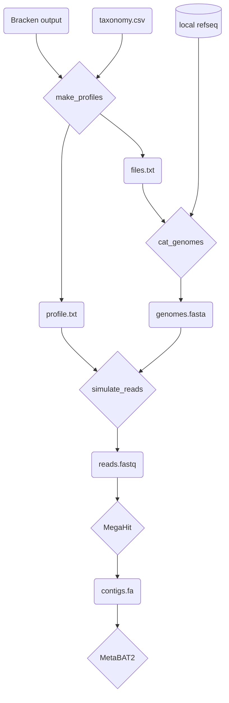

# Simulate Reads using InSilicoSeq

This is a Snakemake pipeline for generating simulated reads from reference genomes with specified abundances.

## Pipeline description

1. Generate a profile from Bracken output
2. Concatenate the genomes present in the profile to a multifasta file
3. Simulate reads using InSilicoSeq
4. Assemble contigs using MegaHit
5. Bin contigs using MetaBAT2



### Genome Concatenation

InSiicoSeq treats each record in a multi-FASTA file as a genome, and requires a profile file giving the abundance of head record/genome. However, some genome files have multiple records (*e.g.* separated by chromosome).

The two files are created using scripts located here. First, `bracken_profiler.py` parses bracken output and creates two files: one with the profile, ready for input to InSilicoSeq, and a file with information on the genomes that need to be retrieved, such as file name globs and the record ID that was written in the profile.

Next, `cat_genomes.py` reads the information file, retrieves all the genomes in the profile, removes the record headers for each genome (except the one that matches that in the profile), and writes them all to one large file, which is the other input to InSilicoSeq

### Read Simulation

Several abundance profiles can be created, and the specified genomes must have identifiers that match those in `cat_genomes.fasta`. The list of desired abundance profiles should be given in the `--configfile`, as well as other `iss generate` parameters. Multiple error models can be automatically executed by inclusion in the config["model"] field, which currently includes all pre-built error models.


## `bracken_profiler.py`

This script takes Bracken output and creates a profile for use in ISS. Taxonomic IDs are used to join the Bracken output with my list of refseq genomes. Since not all genomes may be found, the abundances are rescaled so they still add to 1. The abundance profile is written to `*_profile.txt`.

Additionally, a file is created (`*_files.txt`) that contains acession numbers, file globs, and sequence record IDs that are in the profile. The files that match these globs are the files that contain the sequences in the profile.

Example usage
```
 $ ./bracken_profiler.py tests/inputs/bracken_profiler/input_1.txt
Done. Wrote output files to "out".

$ ls out/
input_1_files.txt  input_1_profile.txt

# File globs do not include the parent directory (refseq)
$ head -n 5 out/input_1_files.txt 
accession,filename,seq_id
GCF_000006175.1,archaea/GCF_000006175.1*.fna,NC_014222.1
GCF_001742205.1,bacteria/GCF_001742205.1*.fna,NZ_CP017151.1
GCF_000891875.6,viral/GCF_000891875.6*.fna,NC_015298.1
GCF_013402915.1,fungi/GCF_013402915.1*.fna,NC_050719.1

$ head -n 5 out/input_1_profile.txt
NC_014222.1     0.6525
NZ_CP017151.1   0.21977
NC_015298.1     0.12644
NC_050719.1     0.0013
```
## `cat_genomes.py`

This script concatenates all the genomes that are required for ISS based on the profile.

There are 3 inputs:

* File containing genome information (`*_files.txt` output from `bracken_profiler.py`)
* `-p|--parent`: the parent directory from which the file globs are defined.
* `-o|--outdir`: output directory to write concatenated genomes.

The file globs are not full relative paths, such as *archaea/GCF_000006175.1\*.fna*, so the `--parent` directory is provided to complete the relative path. For instance, if `--parent` = *../../data/refseq*, the full file glob that will be used is *../../data/refseq/archaea/GCF_000006175.1\*.fna*

Example usage
```
$ ./cat_genomes.py -p tests/inputs/cat_genomes/refseq/ tests/inputs/cat_genomes/input_1_files.txt 
Done. Concatenated 4 files to out/input_1_genomes.fasta

$ head -n 5 out/input_1_genomes.fasta
>NC_014222.1 Methanococcus voltae A3, complete sequence
AATTTAAAGATTAAAATTAGTAGACTGTCGATTTACAATATCATATTTATGAGTAATGATAATAACATTATCAAAGTATT
ATCTAAATATTTAGATTTAATATGTTTCTCAATGGAATATGTTAAATTTTATATTTATACATTATTGTAAAATCATAAAA
ATTTTTTAGAAAAATGTCTTAATCTTGCTAATTTTTGATTTATTGCCAAAATACACATTACTCATCAAATGAAAATTAGT
TCAAATATTGTGTATAATGTCCTGTGTAATATTACAAATTACTGTATGTAATATACCGTATGCAATATACAATAGTAAAT

$ grep ">" out/input_1_genomes.fasta 
>NC_014222.1 Methanococcus voltae A3, complete sequence
>NZ_CP017151.1 Limosilactobacillus fermentum strain NCC2970 chromosome, complete genome
>NC_015298.1 Rose rosette virus RNA1, complete genome
>NC_050719.1 Zygotorulaspora mrakii chromosome 1, complete sequence
```

